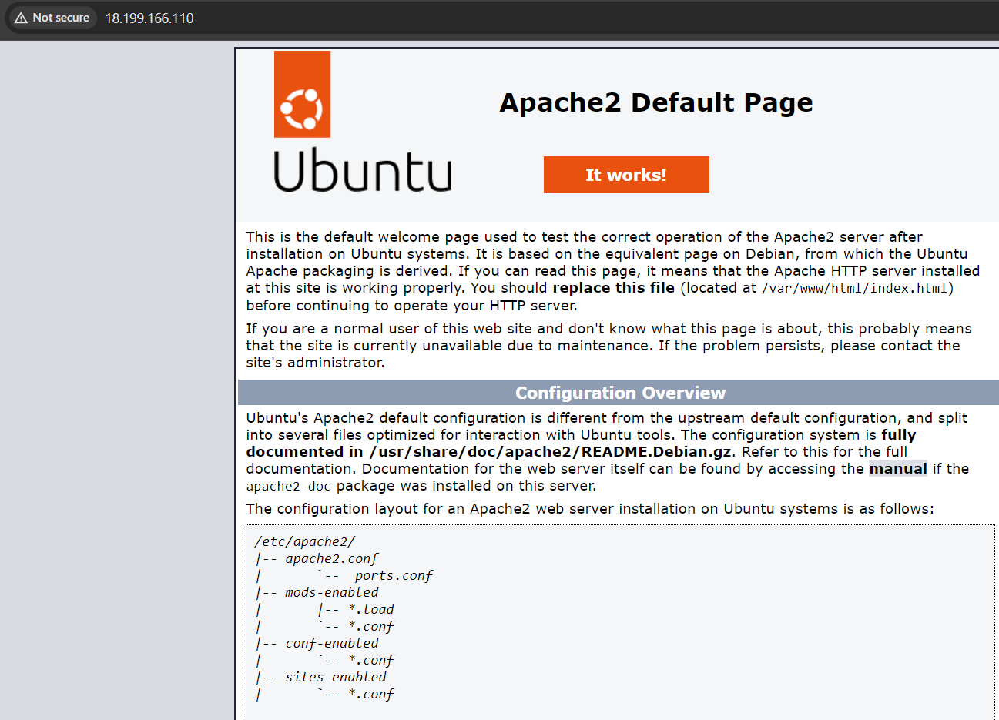
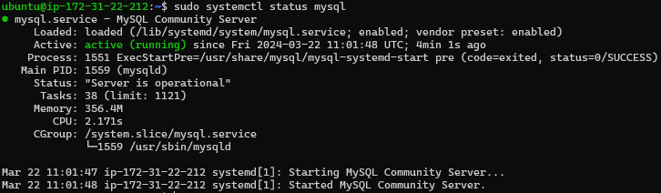
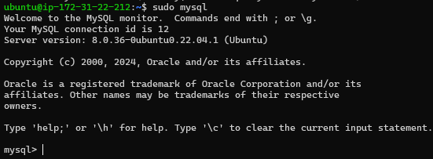
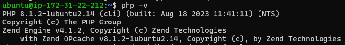
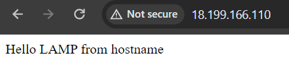

## Documentation of project 1

### Web stack implementation in AWS - LAMP (Linux, Apache, MySQL, PHP or Python, or Perl)

In order to complete this project you will need an AWS account and a virtual server with Ubuntu Server OS.

**Connect with PEM file**


**Install apache**

```
#update a list of packages in package manager
sudo apt update

#run apache2 package installation
sudo apt install apache2
```

## To verify that apache2 is running as a Service in our OS, use following command

```
sudo systemctl status apache2
```


[Install openssh](https://learn.microsoft.com/en-us/windows-server/administration/openssh/openssh_install_firstuse?tabs=powershell#install-openssh-for-windows)

[OpenSSH key management](https://learn.microsoft.com/en-us/windows-server/administration/openssh/openssh_keymanagement)

**Connect with openSSH**


**Accessing Apache from internet**



**Install mysql server**

```
sudo apt install mysql-server
```

**Mysql status**



**Accessing mysql**




**Install php**

```
sudo apt install php libapache2-mod-php php-mysql
```

**Php version**



**Result**

